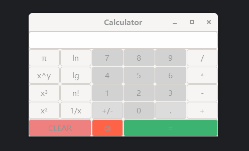

```text
  ___ __ _| | ___ _   _| | __ _| |_ ___  _ __ 
 / __/ _` | |/ __| | | | |/ _` | __/ _ \| '__|
| (_| (_| | | (__| |_| | | (_| | || (_) | |   
 \___\__,_|_|\___|\__,_|_|\__,_|\__\___/|_|                                          
```

README LANGUAGES [ [**English**](README.md) | [中文](README_zh_CN.md)  ]

# **Calculator** (C11 & GTK4)

_School practical work for the subject of Programming Languages,
in the Internet of Things Engineering course at the Jiangsu University._

A lightweight & simple calculator application that can perform basic arithmetic operations, based on C11 language
with [GTK4](https://www.gtk.org/).


Any questions or suggestions are welcome to contact me
via email [**carm@carm.cc**](mailto:carm@carm.cc)
or using [**issues**](https://github.com/CarmJos/calculator/issues/new) (recommend) .

## Features



- Basic arithmetic operations: addition, subtraction, multiplication, division.
- Basic operations: clear, delete, and equal.
- Advanced operations: square root, cubed root, and factorial, etc.
- Based on double numbers.
- Support for keyboard & mouse input.
- Simple & Elegant UI.

## Development


This project depends on [GTK4](https://www.gtk.org/),
so make sure your system has installed the [related runtime libraries](https://github.com/tschoonj/GTK-for-Windows-Runtime-Environment-Installer).

This project is developed using the CLion IDE and built with CMake, 
so you need to install minGW-w64 and CMake to compile and develop normally.

## Design

- **Structure**: Functions are implemented by classification, and each class is responsible for a separate function.
- **Interface**: Use GTK4's CSS style sheet for interface design, which is simple and elegant.
- **Logic**: Use state machine design to implement operators for easy expansion.
- **Link**: Use GTK4's signal and slot mechanism to separate the interface from the logic.

## Open Source Licence

The source code of this project adopts the [GNU General Public License v3.0](https://opensource.org/licenses/GPL-3.0).

## Supports

Many thanks to Jetbrains for kindly providing a license for us to work on this and other open-source projects.  
[](https://www.jetbrains.com/?from=https://github.com/CarmJos/calculator)
