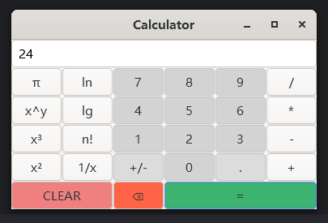

```text
  ___ __ _| | ___ _   _| | __ _| |_ ___  _ __ 
 / __/ _` | |/ __| | | | |/ _` | __/ _ \| '__|
| (_| (_| | | (__| |_| | | (_| | || (_) | |   
 \___\__,_|_|\___|\__,_|_|\__,_|\__\___/|_|                                          
```
README LANGUAGES [ [English](README.md) | [**中文**](README_zh_CN.md)  ]

# **Calculator 计算器**  (C11 & GTK4)

一个轻量的计算器应用程序，基于 C11 语言，使用 [GTK4](https://www.gtk.org/) 作为图形界面库，可以执行基本的算术运算。



若您有任何问题或建议，欢迎通过电子邮件 [**carm@carm.cc**](mailto:carm@carm.cc)  联系我，或使用 [**议题
**](https://github.com/CarmJos/calculator/issues/new) (强力推荐) 向我提问。

## 特性


- 基本算术运算：加、减、乘、除。
- 基本运算：清除、删除、相等。
- 高级运算：平方根、立方根、阶乘等。
- 支持浮点数。
- 支持键盘输入。
- 支持鼠标输入。

## 开发


本项目依赖于 [GTK4](https://www.gtk.org/)，因此在构建和运行之前，请确保您的系统已安装 GTK4 的[相关运行库](https://github.com/tschoonj/GTK-for-Windows-Runtime-Environment-Installer)。

本项目使用 CLion IDE 开发，通过 CMake 进行构建，因此您需要安装 minGW-w64 和 CMake 才可正常编译开发。

## 设计

- 文件结构：功能分类实现，每一个类负责单独的功能。
- 界面设计：使用 GTK4 的 CSS 样式表进行界面设计，简洁大方。
- 逻辑设计：使用状态机设计，实现运算符，方便扩展。
- 链接设计：使用 GTK4 的信号与槽机制，实现界面与逻辑的分离。

## 开源许可证

此项目的源代码采用 [GNU 通用公共许可证 v3.0](https://opensource.org/licenses/GPL-3.0)。

## 支持

万分感谢 JetBrains 慷慨地为我提供免费许可证，以便我在此和其他开源项目上工作。  
[](https://www.jetbrains.com/?from=https://github.com/CarmJos/calculator)